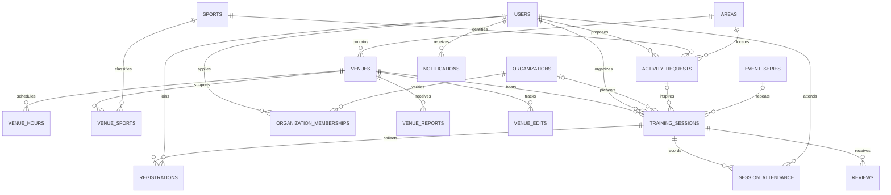

# Архитектура и план курсового проекта

## 1. Граница системы

Приложение организует встречи людей для любительских тренировок и хранит созданные им расписания. Адресный каталог импортируется из открытого набора № 893. Данные пользователей, занятий, записей и отзывов создаются в самом приложении. Проект не получает от города разрешения на использование площадки, не проводит оплату и не показывает её занятость вне приложения.

## 2. Уровни

1. Клиент: браузер, адаптивные страницы HTML/CSS, формы с защитой CSRF.
2. Сервер приложений: Flask маршрутизирует запросы, объектные политики ролей контролируют доступ, правила тренировок проверяют время и число участников.
3. База: SQLite, транзакции, внешние ключи, ограничения статусов, уникальность записей. Импорт по `global_id` обновляет открытые сведения, сохраняя пользовательские данные.

Для демонстрации запуск на одном компьютере достаточен. При развёртывании нескольких серверов SQLite надо заменить серверной СУБД и обеспечить миграцию схемы. Архитектура браузер → сервер → СУБД при этом сохраняется.

## 3. Сущности

Ключ площадки `source_id` берётся из поля `global_id` исходного набора. Признаки стоимости, сезонности и доступности остаются атрибутами площадки; расписание из семи повторяющихся элементов нормализовано в `venue_hours`. Связь организатора с организацией подтверждает администратор; новая встреча обязательно привязана к подтверждённой организации. Старые встречи, созданные до обновления, сохраняют пустой внешний ключ организации. Участие и отзыв связывают пользователя с конкретной тренировкой. Уникальные ограничения исключают две записи одного пользователя на одну тренировку.

## 4. Бизнес-процессы для пояснительной записки

| № | Процесс | Измеряемый результат | Позитивный тест |
|---|---|---|---|
| 1 | Поиск площадки | Выдача по адресу или виду площадки | Найден объект в нужном районе |
| 2 | Создание тренировки | Заявка со статусом `pending` | Организатор создал занятие |
| 3 | Проверка тренировки | Статус `published` либо решение об отказе | Администратор опубликовал занятие без конфликта |
| 4 | Подача заявки | Строка `registrations` со статусом `pending` | Заявка видна у участника и организатора |
| 5 | Решение организатора | Статус `active`, `waitlist_approved` или `rejected` и счётчик занятых мест | Подтверждение не превышает вместимость |
| 6 | Отмена заявки или записи | Статус `cancelled`, занятое место освобождается | Участник отменил участие |
| 7 | Сообщение о площадке | Обращение в очереди администратора площадок | Сообщение не подменяет запись |
| 8 | Модерация отзыва | Публичное отображение одобренного отзыва | Отзыв участника опубликован после проверки |
| 9 | Подтверждение организатора | Одобрена связь с организацией | До одобрения создание и управление заявками запрещены |
| 10 | Предложение жителя | Идея занятия по виду спорта и району | Организатор видит спрос, после публикации появляется ссылка на встречу |
| 11 | Еженедельная серия | Связанные даты занятий | Проверка серии атомарна при пересечении расписания |
| 12 | Очередь и уведомления | Решение организатора и сообщение участнику | Освободившееся место получает первый одобренный в очереди |
| 13 | Посещаемость | Отметка подтверждённого участника | После начала встречи организатор ставит отметку |
| 14 | Проверка площадки | История исправленных полей | Повторный импорт не перезаписывает исправленную карточку |

Измерения времени, трафика, памяти и размера БД следует проводить на заданной конфигурации после фиксации интерфейса; архивные данные не являются готовыми результатами измерений.

После переноса опубликованной тренировки прежние `pending` и `active` регистрации переходят в `cancelled`, а занятие снова ожидает публикации. Отмена мероприятия также отменяет связанные заявки. Исторические строки остаются в SQLite; участие после завершения тренировки задним числом не меняется. На скрытую площадку новые заявки и подтверждения не принимаются.

## 5. Что уже реализовано и что ещё требуется

Реализованы импорт 4751 строк из версии 2021 года, роли, основные сценарии, административная панель, CSV-отчёт и проверки сквозных процессов. Следующие этапы курсовой: актуальная выгрузка и повторный аудит качества; диаграмма в нотации Мартина с атрибутами и кратностями; сравнительная таблица не менее 11 программных средств; семь протоколов тестирования со снимками интерфейса; инструментальные замеры производительности; пояснительная записка и презентация. Дополнительно следует уточнить правила использования спортивных объектов и оформить документы по обработке персональных данных для сценария реального развёртывания.

Это учебная первая версия. Её метрики и интерфейс не следует описывать в пояснительной записке как испытанные в производственной эксплуатации.
